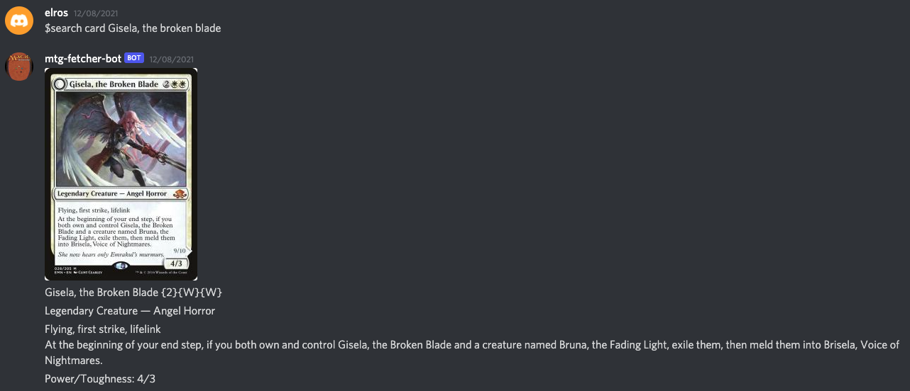

# MTG card fetcher bot
A simple discord bot to fetch MTG cards data from scryfall:

## Usage
Send the message `$search card` followed by a space and the name of the card. It uses [Scryfall's fuzzy search](https://scryfall.com/docs/api/cards/named) of the card name string so if the inputted string could be unambiguously identified (that is, with minor spelling mistakes) it will return the object correctly.